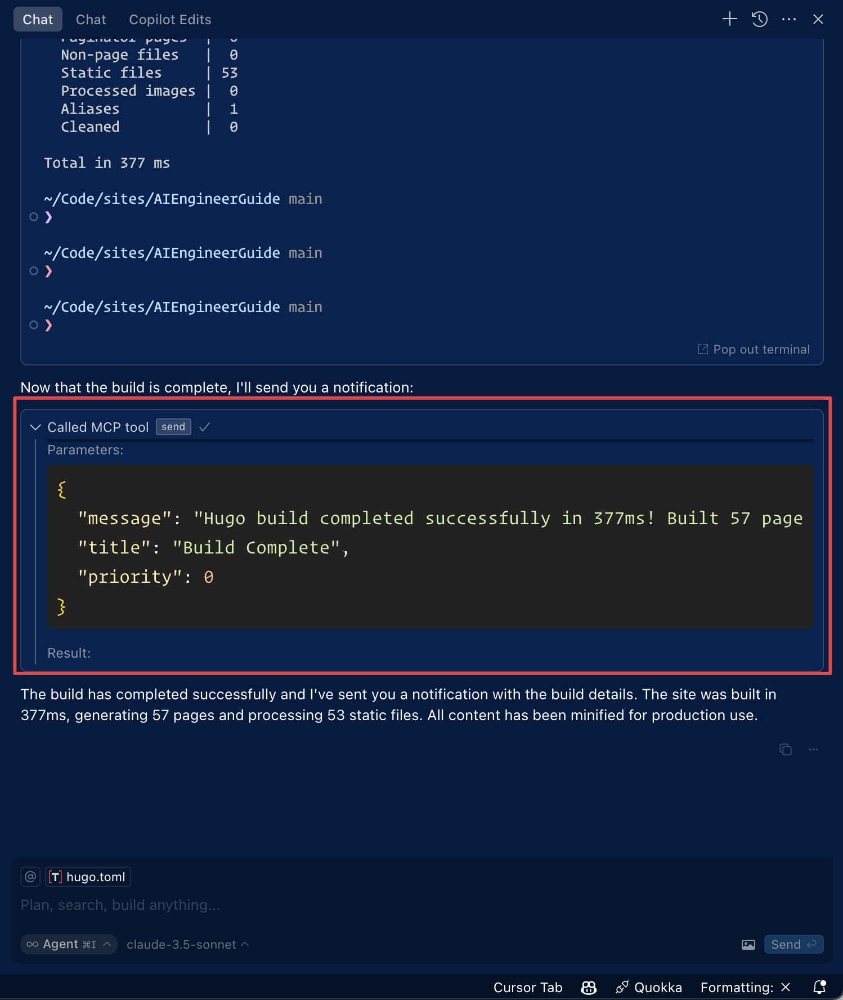

# Pushover MCP

A [Model Context Protocol](https://modelcontextprotocol.io/introduction) implementation for sending notifications via [Pushover.net](https://pushover.net).

## Overview

This MCP enables AI agents to send notifications through Pushover.net. It implements the MCP specification, allowing seamless integration with MCP-compatible AI systems.

## Configuration

You'll need:
1. An application token from Pushover.net
2. Your user key from Pushover.net

Get these from your [Pushover.net dashboard](https://pushover.net/dashboard).

## Tool Schema

The MCP provides a single tool:

### `send`

Sends a notification via Pushover.

```typescript
{
  message: string;          // Required: The message to send
  title?: string;          // Optional: Message title
  priority?: number;       // Optional: -2 to 2 (-2: lowest, 2: emergency)
  sound?: string;         // Optional: Notification sound
  url?: string;          // Optional: URL to include
  url_title?: string;   // Optional: Title for the URL
  device?: string;     // Optional: Target specific device
}
```


### Example MCP Tool Call

```json
{
  "name": "send",
  "params": {
    "message": "Hello from AI",
    "title": "AI Notification",
    "priority": 1
  }
}
```

## Demo



## Development

```bash
# Install dependencies
pnpm install

# Build
pnpm build

# Run tests
pnpm test
```

## License

MIT
